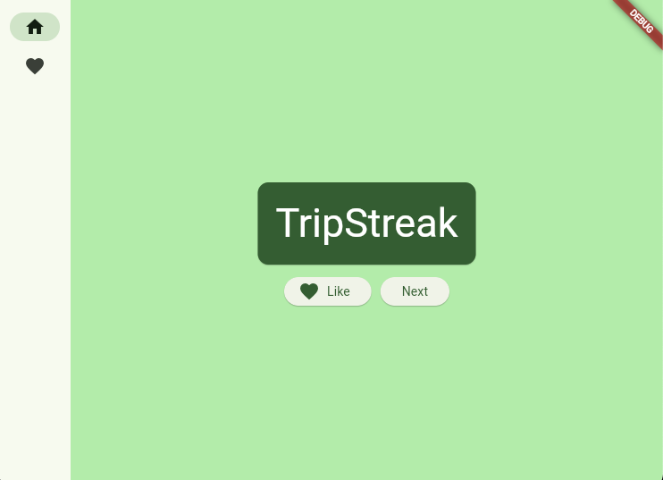
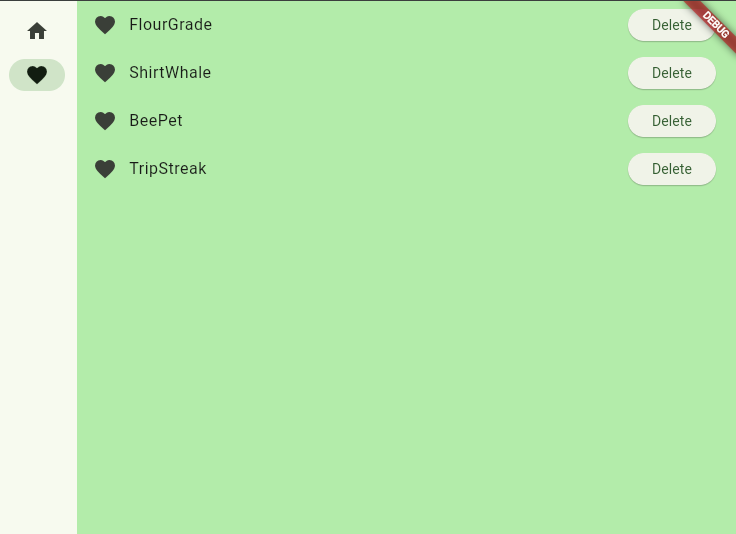

# flutter_application_1

A Flutter project to learn an explore this framework.

It's basically a simple app that generates new composed words that you can add to favorites. You can also always see your favorite words and delete them afterwards if needed.

## Getting Started

A few resources to get you started with Flutter where you can also find a nice tutorial to build an app like this.

- [Lab: Write your first Flutter app](https://docs.flutter.dev/get-started/codelab)
- [Cookbook: Useful Flutter samples](https://docs.flutter.dev/cookbook)

For help getting started with Flutter development, view the
[online documentation](https://docs.flutter.dev/), which offers tutorials, samples, guidance on mobile development, and a full API reference.
